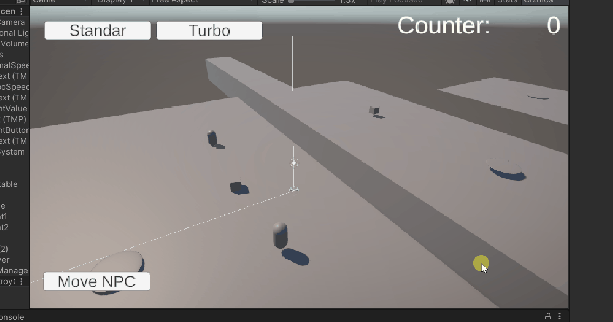
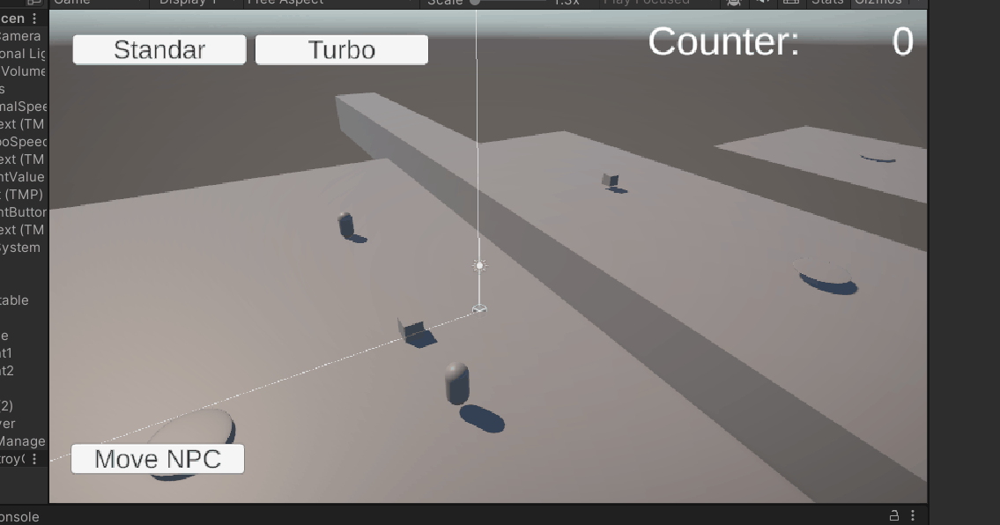
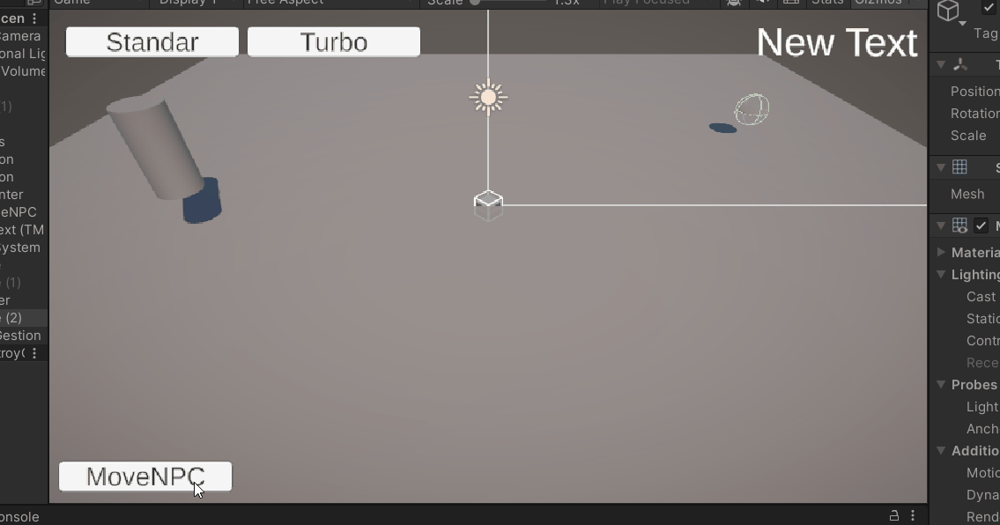
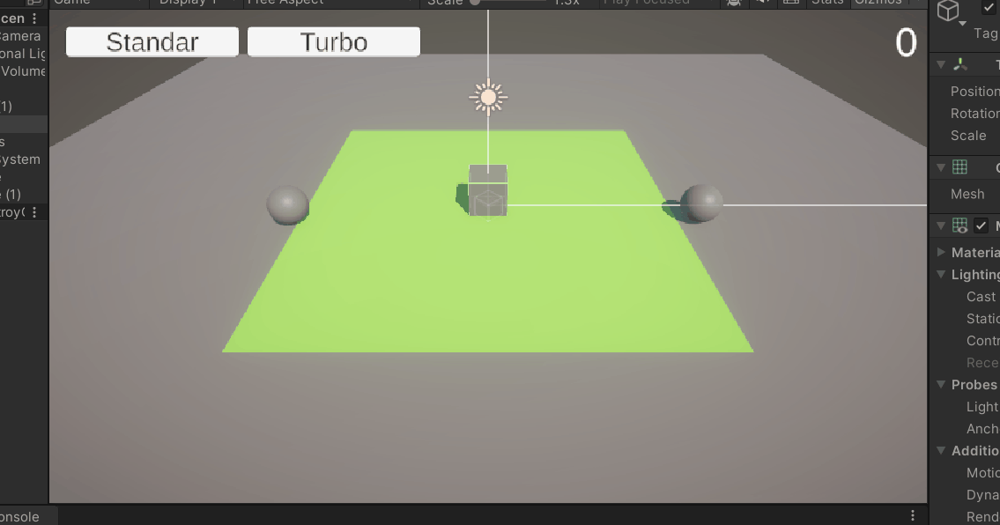

# FDV_MovementAndEvent

## Implementar una UI que permita configurar con qué velocidad te moverás: turbo o normal. También debe mostar la cantidad de objetos recolectados y si chocas con alguno especial restar fuerza. Agregar a tu escena un objeto que al ser recolectado por el jugador haga que otros objetos obstáculos se desplacen de su trayectoria.
Se han creado varios botones en un Canva para crear un prototipo de UI capaz de modificar la velocidad del jugador, mostrar los puntos y mover al NPC (Se emplea posteriormente)

## Agrega un objeto que te teletransporte a otra zona de la escena.
Se han añadido dos objetos que hacen de "base" para hacer de teletransporte para el jugador

## Agrega un personaje que al clickar sobre un botón de la UI se dirija hacia un objetivo estático en la escena.
El botón activa una función que lleva al NPC hasta su target

## Agrega un personaje que siga el movimiento del jugador cuando éste llegue al límite de un recinto que incluyas en la escena.
Se han incluido dos esferas que siguen al jugador cuando este abandona la zona verde

